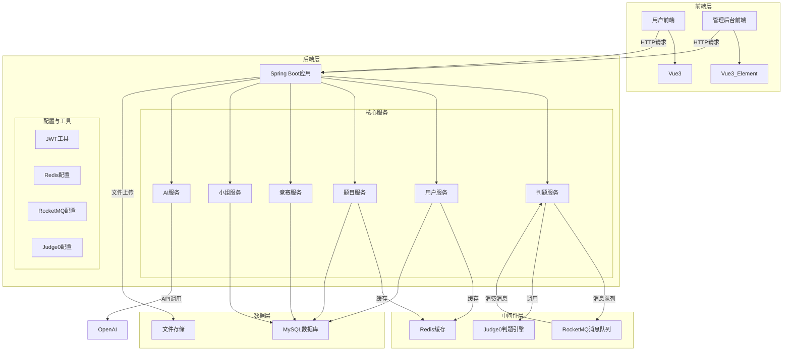
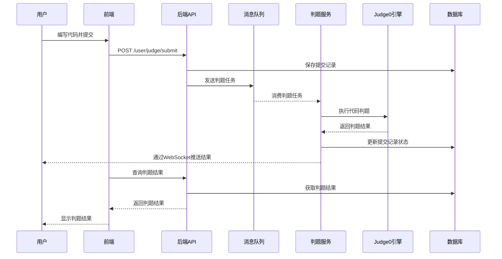
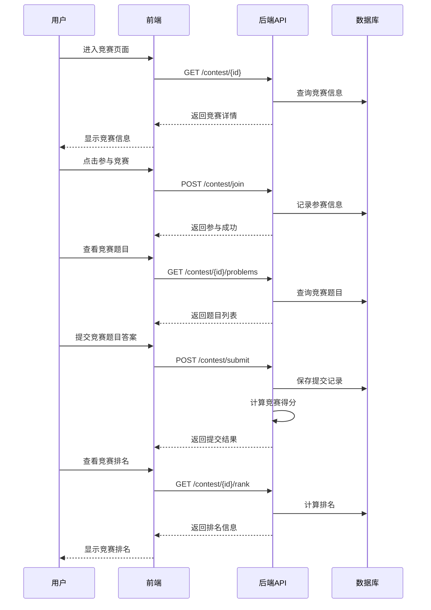
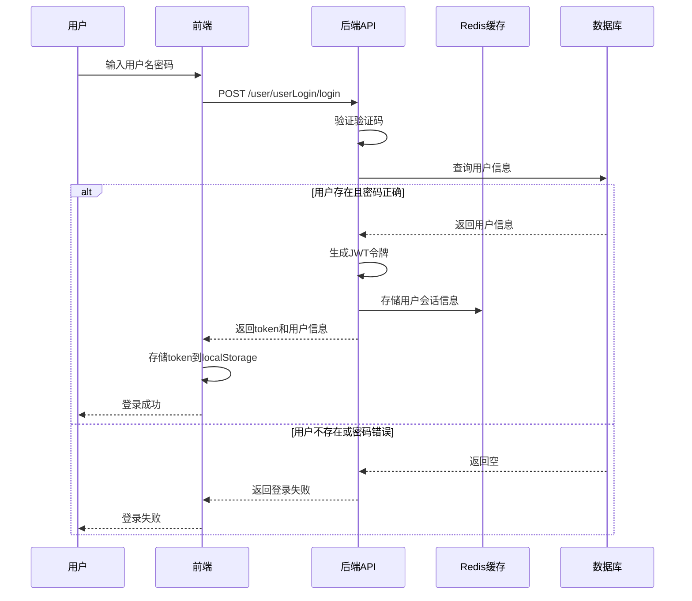
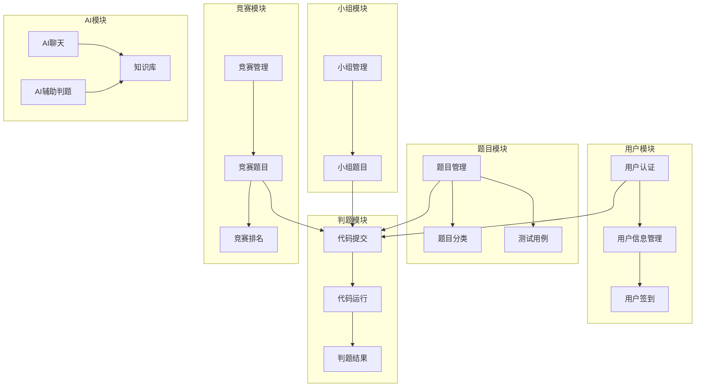

## 一、项目概述

### 1.1 项目简介

本项目是一个功能完善的**在线判题系统（Online Judge）**，采用前后端分离架构，支持代码提交、自动判题、AI辅助判题、竞赛管理、题组管理等功能。系统集成了先进的AI技术，实现了AI判题、错误分析、智能提示等创新功能。

### 1.2 项目结构

```
oj-project/
└── src/main/java/com/sky/
    ├── constant/         # 常量定义（如 MqConstant、MessageConstant）
    ├── context/          # 上下文（如 BaseContext）
    ├── enumeration/      # 枚举类（如 ActivityType）
    ├── exception/        # 异常类（如 BaseException）
    ├── properties/       # 配置属性（如 JwtProperties）
    ├── result/           # 统一返回（如 Result、PageResult）
    └── utils/            # 工具类（如 JwtUtil、AliOssUtil）
oj-pojo/
└── src/main/java/com/sky/
    ├── dto/              # 数据传输对象（如 JudgeTaskMessage、DatabaseUpdateMessage）
    ├── entity/           # 实体类（如 Problem、Submission、TestCase）
    └── vo/               # 视图对象（如 JudgeResultVO、ContestVO）
oj-web/
└── src/main/java/com/sky/
    ├── config/           # 配置类（如 Judge0Client、RedisConfiguration）
    ├── controller/       # 控制器
    │   ├── admin/        # 管理端接口（如 ProblemController、ContestController）
    │   └── User/         # 用户端接口（如 JudgeController、SubmissionController）
    ├── mapper/           # 数据访问层（如 ProblemMapper、SubMissionMapper）
    ├── mq/               # 消息队列消费者
    │   ├── JudgeTaskConsumer.java           # 判题任务消费者
    │   ├── DatabaseUpdateConsumer.java      # 数据库更新消费者
    │   ├── JudgeTaskDeadLetterConsumer.java # 判题任务死信队列消费者
    │   └── DatabaseUpdateDeadLetterConsumer.java # 数据库更新死信队列消费者
    ├── service/          # 服务层
    │   ├── impl/         # 服务实现（如 JudgeServiceImpl）
    │   └── 接口定义       # 服务接口
    └── websocket/        # WebSocket服务（如 WebSocketServer）
```

### 1.3 功能模块概览

| 模块     | 用户端 | 管理端 | 说明                       |
| -------- | :----: | :----: | -------------------------- |
| 题目浏览 |   ✅    |   ✅    | 题目列表、详情、搜索筛选   |
| 代码编辑 |   ✅    |   -    | Monaco编辑器、多语言支持   |
| 代码判题 |   ✅    |   -    | Judge0引擎、AI判题         |
| 提交记录 |   ✅    |   ✅    | 历史提交、状态筛选         |
| 比赛系统 |   ✅    |   ✅    | 比赛列表、参赛、排名       |
| 题组系统 |   ✅    |   ✅    | 题目集合、学习路径         |
| 讨论区   |   ✅    |   -    | 题目讨论、评论回复         |
| 题解系统 |   ✅    |   -    | 题解发布、Markdown渲染     |
| AI辅助   |   ✅    |   -    | AI判题、错误分析、智能提示 |
| 用户管理 |   -    |   ✅    | 用户列表、状态管理         |
| 数据统计 |   -    |   ✅    | 可视化图表、运营数据       |
| 知识库   |   -    |   ✅    | PDF导入、向量检索          |

---

## 二、技术架构

### 2.1 整体架构图



### 2.2 技术栈详情

#### 用户端技术栈

| 技术          | 版本    | 用途                      |
| ------------- | ------- | ------------------------- |
| Vue           | 3.2.38  | 渐进式JavaScript框架      |
| Vue Router    | 4.6.4   | 单页面应用路由管理        |
| Pinia         | 3.0.4   | 新一代状态管理工具        |
| Element Plus  | 2.13.1  | Vue 3 UI组件库            |
| Monaco Editor | 0.55.1  | 代码编辑器（VS Code同款） |
| Axios         | 1.13.2  | HTTP请求库                |
| Marked        | 17.0.3  | Markdown解析器            |
| Highlight.js  | 11.11.1 | 代码语法高亮              |
| Vite          | 3.0.9   | 下一代前端构建工具        |

#### 管理端技术栈

| 技术         | 版本    | 用途                 |
| ------------ | ------- | -------------------- |
| Vue          | 3.2.38  | 渐进式JavaScript框架 |
| Vue Router   | 4.6.4   | 路由管理             |
| Element Plus | 2.4.4   | UI组件库             |
| ECharts      | 6.0.0   | 数据可视化图表库     |
| Axios        | 1.13.1  | HTTP请求库           |
| Highlight.js | 11.11.1 | 代码语法高亮         |

#### 后端技术栈

| 技术         | 版本     | 用途                    |
| ------------ | -------- | ----------------------- |
| Spring Boot  | 3.3.6    | 核心框架                |
| Java         | 17       | 编程语言                |
| MyBatis Plus | 3.5.7    | ORM框架，简化数据库操作 |
| MySQL        | 8.0+     | 关系型数据库            |
| Redis        | 7.0+     | 缓存、限流、向量存储    |
| RocketMQ     | 2.3.1    | 消息队列，异步处理      |
| Spring AI    | 1.0.0-M5 | AI集成框架              |
| Judge0       | -        | 代码执行引擎            |
| WebSocket    | -        | 实时双向通信            |
| JWT          | 0.12.6   | JSON Web Token认证      |
| Knife4j      | 4.5.0    | API文档生成             |
| Druid        | 1.2.23   | 数据库连接池            |
| Aliyun OSS   | 3.10.2   | 对象存储服务            |

---

## 三、核心流程图

### 3.1 判题流程图



### 3.2 竞赛参与流程



### 3.3 用户认证流程图


### 3.4 RAG知识库流程图

```
┌─────────────────────────────────────────────────────────────────────────────┐
│                          RAG知识库问答流程                                   │
└─────────────────────────────────────────────────────────────────────────────┘

┌─────────────────────────────────────────────────────────────────────────────┐
│                              知识导入                                        │
└─────────────────────────────────────────────────────────────────────────────┘

PDF文档 ──► 文档解析 ──► 文本分片 ──► 向量嵌入 ──► 存储到Redis
                                              │
                                              ▼
                                        向量数据库
                                     (Redis Vector Store)


┌─────────────────────────────────────────────────────────────────────────────┐
│                              知识检索                                        │
└─────────────────────────────────────────────────────────────────────────────┘

用户提问
    │
    ▼
文本向量化
    │
    ▼
向量相似度搜索 ──► 返回Top-K相关文档
    │
    ▼
构建增强上下文
    │
    ├─── 系统提示词
    ├─── 检索到的知识
    └─── 用户问题
    │
    ▼
调用AI生成回答
    │
    ▼
返回答案给用户
```

### 3.5 系统模块关系图



---

## 四、项目功能

### 4.1 技术功能

1. **AI深度集成**
   - AI判题：无测试用例时AI分析代码正确性
   - AI错误分析：智能分析代码错误原因
   - AI提示系统：循序渐进引导用户思考
   - RAG知识库：向量检索增强的AI问答

2. **实时判题系统**
   - WebSocket实时推送判题结果
   - HTTP轮询降级方案
   - SSE流式响应

3. **高并发设计**
   - Redis Lua脚本限流
   - 消息队列异步处理
   - 防重复提交机制

4. **完善的用户体系**
   - 角色权限管理
   - 积分系统
   - Rating系统
   - 签到系统

### 4.2 业务功能

1. **多题型支持**
   - 算法题
   - 数据库题（SQL）
   - Shell题
   - 并发题

2. **多语言支持**
   - Java
   - Python
   - C++
   - JavaScript
   - Go
   - Rust

3. **完整的比赛系统**
   - 周赛
   - 双周赛
   - 模拟面试
   - 企业专场

4. **知识库系统**
   - PDF文档导入
   - 向量检索
   - RAG增强问答

---

## 五、部署说明

沙箱部署请看官方网址[judge0/judge0: Robust, fast, scalable, and sandboxed open-source online code execution system for humans and AI.](https://github.com/judge0/judge0)

我自己总结了一些配置问题

[关于开源代码沙箱judge0部署的一些问题-CSDN博客](https://blog.csdn.net/2403_88365785/article/details/159085903?spm=1001.2014.3001.5501)

### 5.1 环境要求

| 组件     | 版本要求 |
| -------- | -------- |
| JDK      | 17+      |
| Node.js  | 16+      |
| MySQL    | 8.0+     |
| Redis    | 7.0+     |
| RocketMQ | 5.0+     |

### 5.2 配置文件

#### 后端配置 (application.yml)

```yaml
server:
  port: 8080

spring:
  datasource:
    url: jdbc:mysql://localhost:3306/oj_system
    username: root
    password: your_password
  data:
    redis:
      host: localhost
      port: 6379
  ai:
    openai:
      api-key: your_api_key
      base-url: https://api.openai.com

judge0:
  url: http://localhost:2358

rocketmq:
  name-server: localhost:9876
```

#### 前端配置 (vite.config.js)

```javascript
export default defineConfig({
  server: {
    port: 5174,
    proxy: {
      '/api': {
        target: 'http://localhost:8080',
        changeOrigin: true,
        rewrite: (path) => path.replace(/^\/api/, '')
      }
    }
  }
})
```

### 5.3 启动步骤

#### 后端启动

```bash
# 1. 创建数据库
mysql -u root -p < init.sql

# 2. 启动Redis
redis-server

# 3. 启动RocketMQ
mqnamesrv
mqbroker -n localhost:9876

# 4. 启动Judge0
docker-compose up -d

# 5. 启动后端服务
mvn spring-boot:run
```

#### 前端启动

```bash
# 用户端
cd vue-project1
npm install
npm run dev

# 管理端
cd vue-Element
npm install
npm run dev
```

### 5.4 访问地址

| 服务    | 地址                           |
| ------- | ------------------------------ |
| 用户端  | http://localhost:5174          |
| 管理端  | http://localhost:5173          |
| 后端API | http://localhost:8080          |
| API文档 | http://localhost:8080/doc.html |

---

## 六，项目界面

### 登录界面


### 刷题界面


### 后台登录界面


### 管理界面


