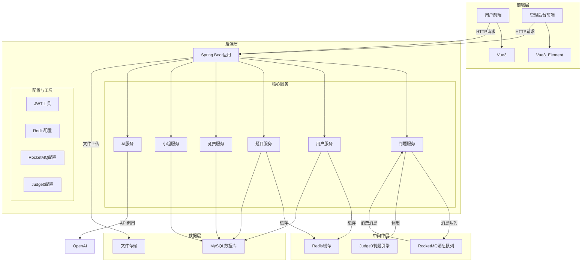
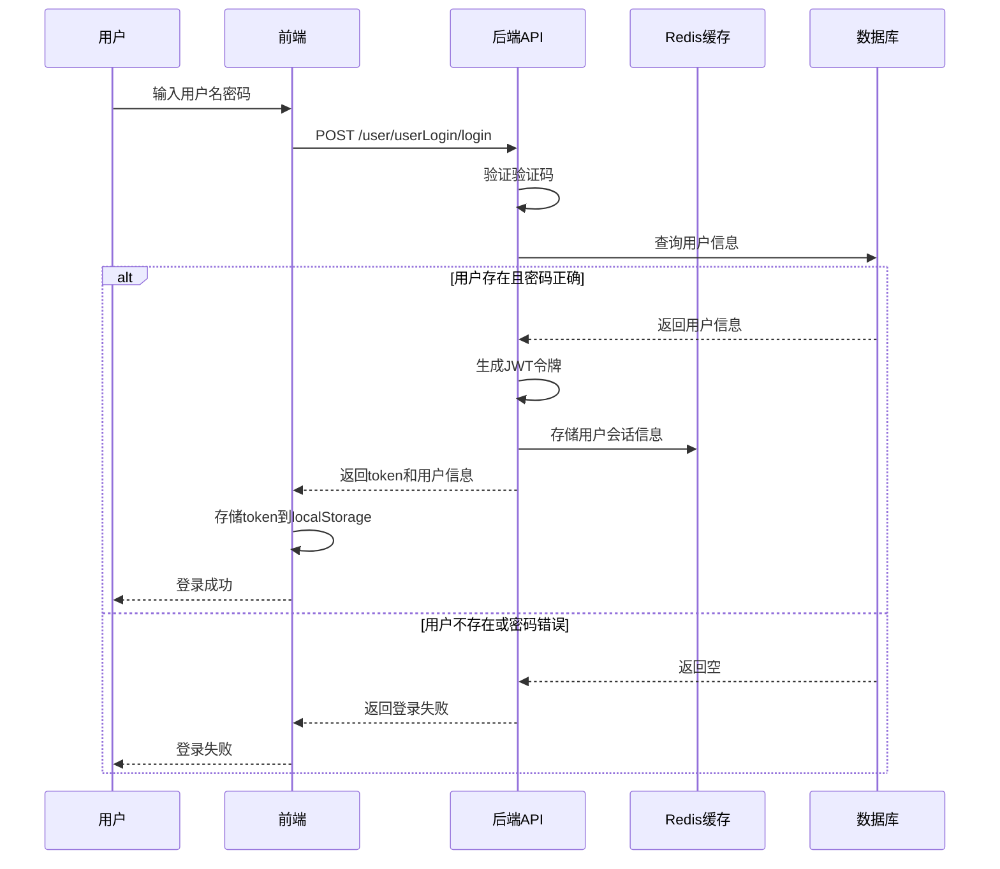
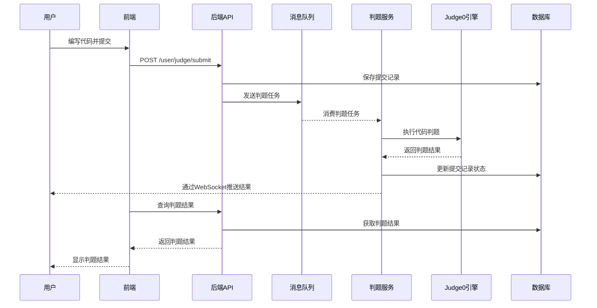
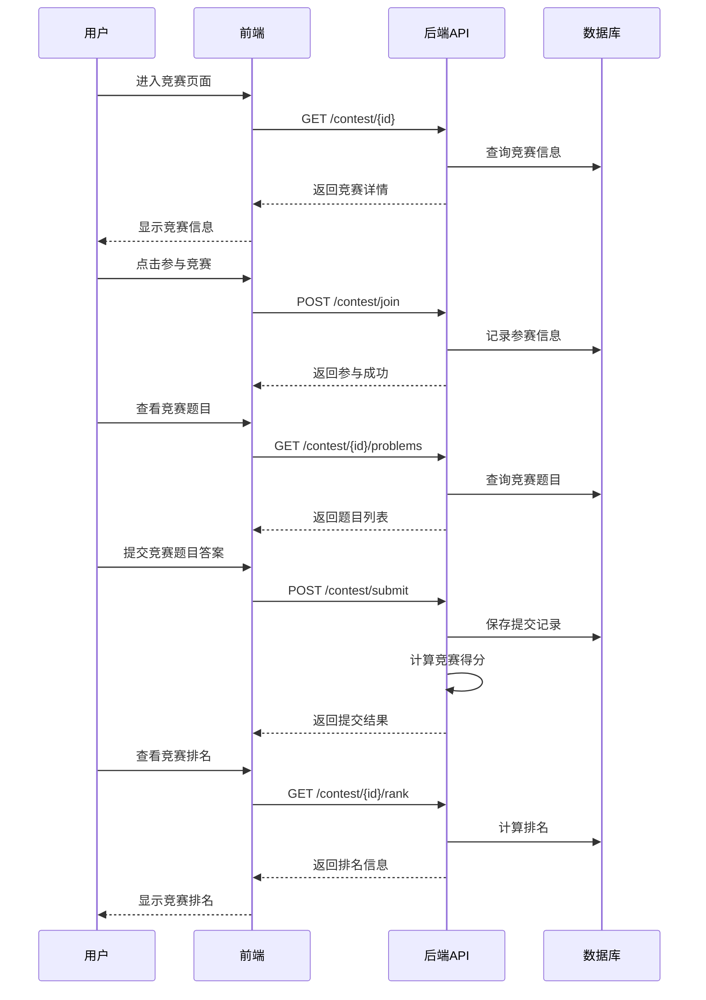
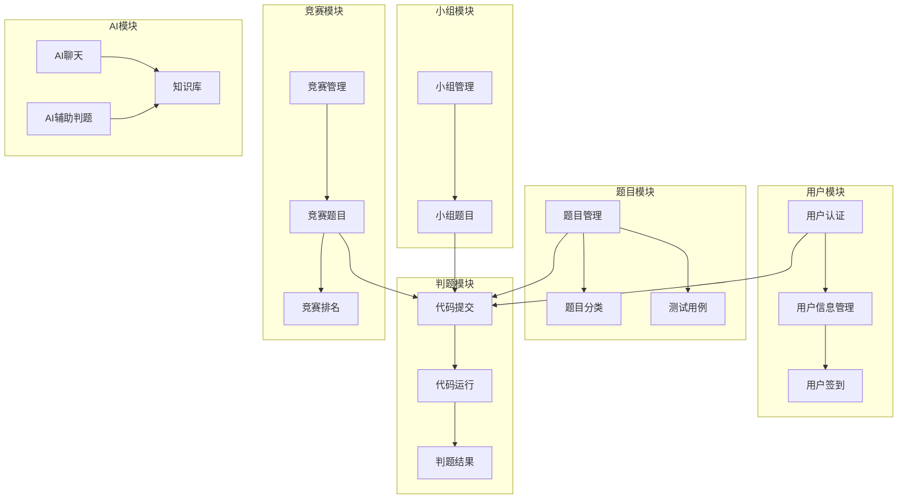
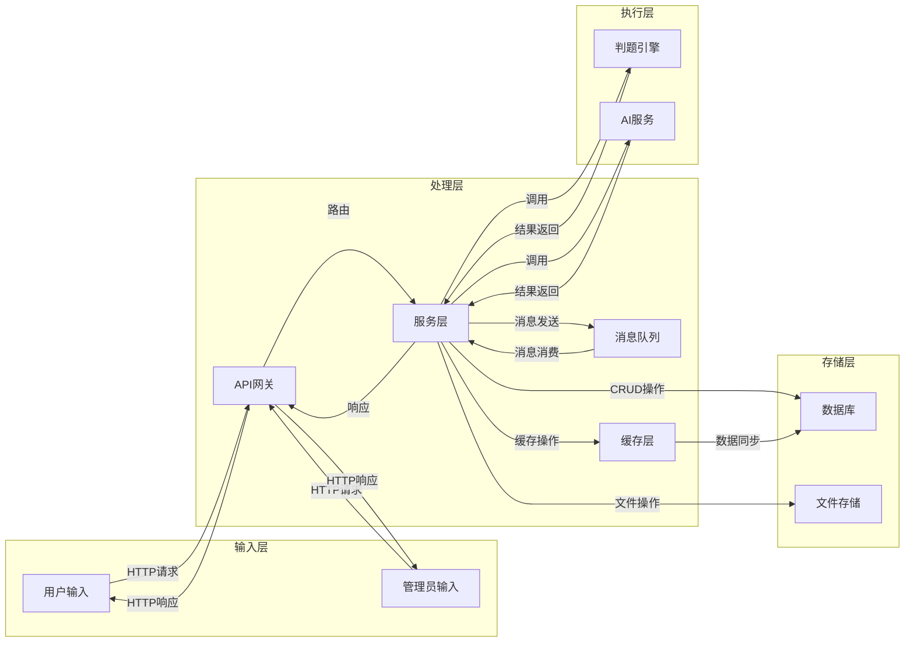
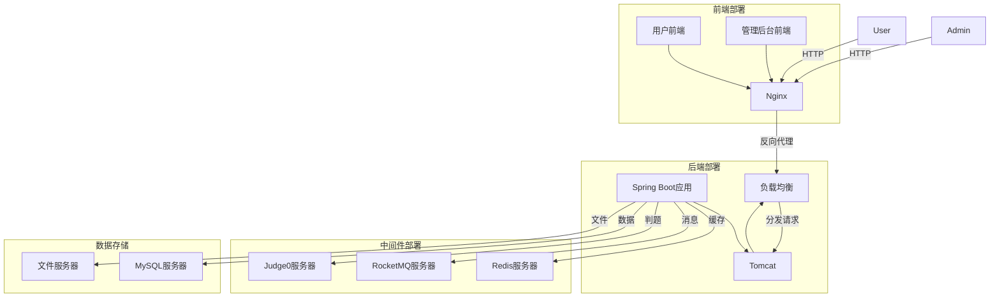

# OJ项目架构与流程分析

## 1. 整体架构图

## 2. 核心功能流程图

### 2.1 用户登录流程

### 2.2 代码提交判题流程

### 2.3 竞赛参与流程

## 3. 系统模块关系图

## 4. 数据流向图

## 5. 技术栈分析

| 类别 | 技术 | 用途 | 来源 |
|------|------|------|------|
| 前端框架 | Vue 3 | 用户前端界面 | d:\vue\vue-project1\src |
| 前端框架 | Vue 3 + Element Plus | 管理后台界面 | d:\vue\vue-project1\vue-Element\src |
| 后端框架 | Spring Boot | 后端应用框架 | d:\vue\vue-project1\vue-Element\oj-project\oj-web |
| 数据库 | MySQL | 数据存储 | application.yml |
| 缓存 | Redis | 缓存和会话管理 | application.yml |
| 消息队列 | RocketMQ | 判题任务队列 | application.yml |
| 判题引擎 | Judge0 | 代码判题 | Judge0Config.java |
| AI服务 | OpenAI API | AI辅助功能 | application.yml |
| 认证 | JWT | 用户认证 | JwtUtil.java |
| 文档 | Swagger/Knife4j | API文档 | application.yml |

## 6. 核心API分析

### 6.1 用户相关API
- `POST /user/userLogin/login` - 用户登录
- `POST /user/userRegister` - 用户注册
- `GET /user/userInfo` - 获取用户信息
- `PUT /user/userInfo` - 更新用户信息
- `GET /user/userInfo/sign` - 用户签到
- `GET /user/userInfo/sign/count` - 获取签到统计

### 6.2 题目相关API
- `GET /user/problem/type` - 获取题目列表
- `GET /user/problem/alltype` - 获取题目分类
- `GET /user/problem/{id}` - 获取题目详情

### 6.3 判题相关API
- `POST /user/judge/submit` - 提交代码判题
- `POST /user/judge/run` - 运行代码

### 6.4 竞赛相关API
- `GET /contest/{id}` - 获取竞赛详情
- `POST /contest/join` - 参与竞赛
- `GET /contest/{id}/problems` - 获取竞赛题目
- `POST /contest/submit` - 提交竞赛题目
- `GET /contest/{id}/rank` - 获取竞赛排名

### 6.5 小组相关API
- `GET /group` - 获取小组列表
- `GET /group/{id}` - 获取小组详情

## 7. 系统特点

1. **模块化设计**：后端采用分层架构，各模块职责清晰
2. **异步判题**：使用RocketMQ实现判题任务的异步处理
3. **缓存优化**：使用Redis缓存热点数据，提升性能
4. **AI集成**：集成OpenAI API，提供智能辅助功能
5. **前后端分离**：前端使用Vue 3，后端使用Spring Boot，通过API交互
6. **安全性**：使用JWT进行用户认证，保护API安全
7. **可扩展性**：模块化设计使得系统易于扩展和维护

## 8. 部署架构

