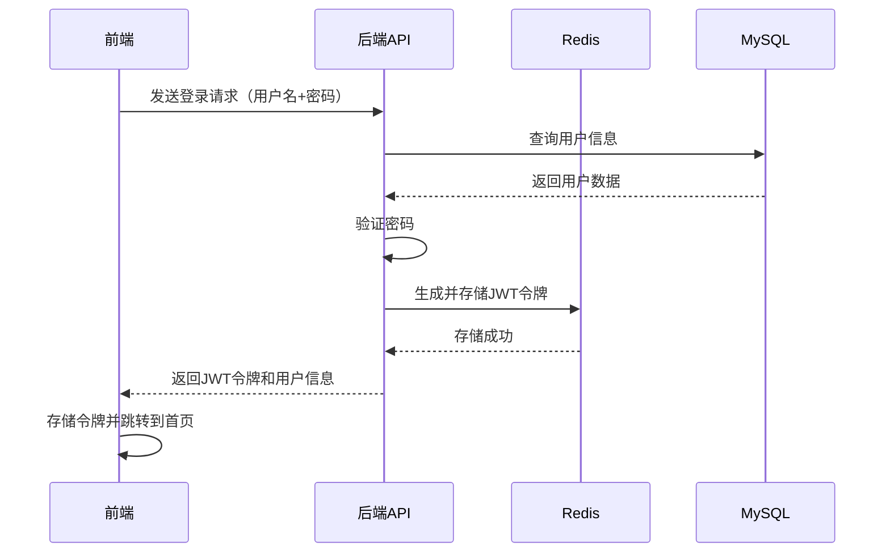
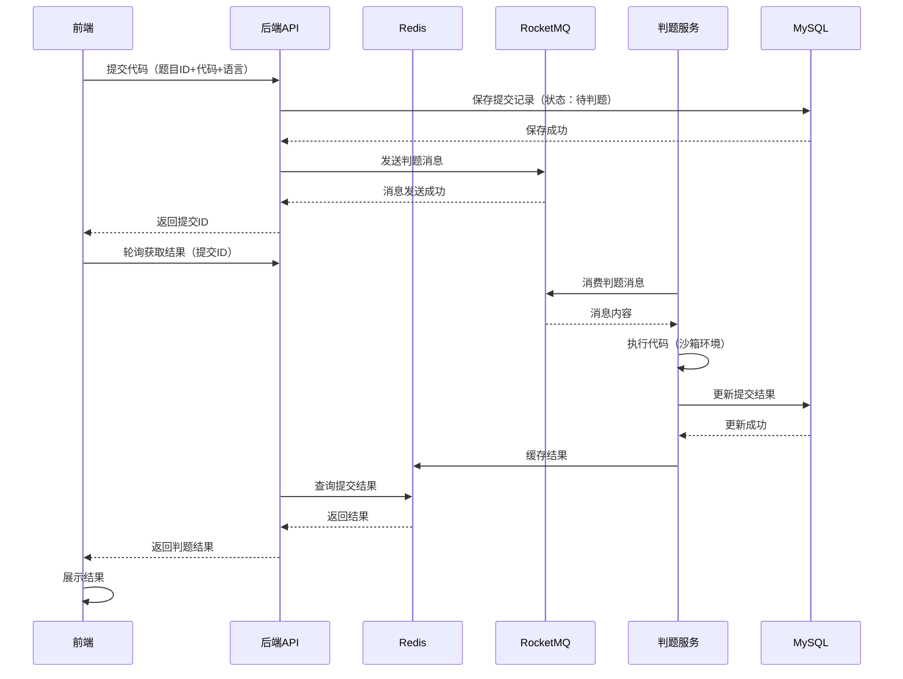

# 刷题网站界面设计文档

## 一、项目概述

本项目是一个基于 **Vue 3 + Spring Boot + MyBatis-Plus + RocketMQ + Redis** 的在线刷题网站，旨在为用户提供优质的算法学习和编程练习平台。网站包含面向用户的**刷题界面**和面向管理员的**后台管理界面**。

## 二、技术栈

| 类别 | 技术 | 版本 | 用途 |
|------|------|------|------|
| 前端框架 | Vue | 3.x | 构建用户界面 |
| 路由管理 | Vue Router | 4.x | 页面路由控制 |
| 状态管理 | Pinia | 2.x | 全局状态管理 |
| UI组件库 | Element Plus | 2.x | 提供丰富的UI组件 |
| HTTP客户端 | Axios | 1.x | 发送HTTP请求 |
| 代码编辑器 | Monaco Editor | 0.34.x | 集成代码编辑功能 |
| 后端框架 | Spring Boot | 2.7.x | 构建后端服务 |
| ORM框架 | MyBatis-Plus | 3.5.x | 简化数据库操作 |
| 消息队列 | RocketMQ | 4.9.x | 实现异步判题 |
| 缓存 | Redis | 7.x | 缓存热点数据 |
| 数据库 | MySQL | 8.x | 存储业务数据 |
| 认证授权 | JWT | - | 用户身份验证 |

## 三、刷题界面设计

### 1. 首页

#### 布局结构
- **顶部导航栏**：Logo、导航菜单（首页、题库、竞赛、讨论区、个人中心）、搜索框、登录/注册按钮
- **英雄区域**：网站口号、核心功能介绍、快速入口按钮（开始刷题、查看竞赛）
- **特色功能**：卡片式展示（丰富题库、实时判题、详细解析、社区交流）
- **热门题目**：展示近期热门或推荐题目
- **页脚**：网站信息、联系方式、相关链接

#### 核心功能
- 快速导航到各功能模块
- 展示网站核心优势
- 提供热门题目推荐

### 2. 题目列表页

#### 布局结构
- **筛选区域**：难度筛选（简单/中等/困难）、分类筛选（数组、链表、动态规划等）、标签筛选、排序选项（通过率、提交数、发布时间）
- **题目列表**：表格展示（题目ID、标题、难度、通过率、提交数、标签）
- **分页控件**：底部分页，支持跳转页码

#### 核心功能
- 多维度筛选和排序题目
- 点击题目进入详情页
- 显示题目基本统计信息

### 3. 题目详情与代码编辑器页

#### 布局结构
- **左侧**：题目信息区
  - 题目标题、难度、标签、通过率
  - 题目描述（支持Markdown渲染）
  - 示例输入输出
  - 约束条件
- **右侧**：代码编辑区
  - 语言选择下拉框（Java/Python/C++/JavaScript等）
  - Monaco编辑器（语法高亮、代码补全、行号显示）
  - 运行/提交按钮
  - 提交结果展示区

#### 核心功能
- 查看完整题目描述和示例
- 选择编程语言编写代码
- 运行代码查看测试用例结果
- 提交代码进行完整判题
- 实时显示运行结果和性能指标（时间/内存）

### 4. 提交结果页

#### 布局结构
- **结果概览**：通过/失败状态、得分、运行时间、内存消耗
- **测试用例结果**：列表展示每个测试用例的执行结果
- **错误信息**：如果失败，展示详细错误信息（编译错误/运行时错误/逻辑错误）
- **代码展示**：显示提交的代码
- **操作按钮**：返回编辑、查看他人题解、查看官方题解

#### 核心功能
- 清晰展示判题结果
- 提供详细的错误信息帮助调试
- 支持查看和比较代码

### 5. 个人中心页

#### 布局结构
- **左侧**：个人信息导航（基本信息、解题统计、提交历史、收藏题目、关注列表）
- **右侧**：内容展示区
  - **基本信息**：头像、昵称、邮箱、注册时间、等级
  - **解题统计**：总题数、通过率、各难度分布（图表展示）
  - **提交历史**：分页展示提交记录，支持筛选和搜索
  - **收藏题目**：展示用户收藏的题目
  - **关注列表**：展示关注的用户和粉丝

#### 核心功能
- 管理个人信息
- 查看解题进度和统计数据
- 管理提交历史和收藏题目
- 查看社交关系

## 四、后台管理界面设计

### 1. 登录页

#### 布局结构
- 登录表单（用户名/密码输入框）
- 验证码输入
- 登录按钮
- 忘记密码链接

#### 核心功能
- 管理员身份验证
- 防止暴力破解（验证码）

### 2. 仪表盘

#### 布局结构
- **顶部**：欢迎信息、当前时间、快捷操作按钮
- **核心指标**：卡片式展示（总用户数、总题目数、今日提交量、总判题数）
- **数据统计**：图表展示（用户增长趋势、题目难度分布、每日提交量趋势）
- **系统状态**：服务器CPU、内存使用率、数据库连接数、Redis状态、RocketMQ队列状态

#### 核心功能
- 实时监控系统运行状态
- 展示核心业务数据
- 提供快捷操作入口

### 3. 用户管理页

#### 布局结构
- **筛选区域**：用户名/邮箱搜索、角色筛选、状态筛选、注册时间范围选择
- **用户列表**：表格展示（ID、用户名、邮箱、角色、状态、注册时间、最后登录时间）
- **操作按钮**：编辑、禁用/启用、重置密码、删除、批量操作

#### 核心功能
- 管理用户信息
- 调整用户权限和状态
- 批量处理用户数据

### 4. 题目管理页

#### 布局结构
- **筛选区域**：题目ID/标题搜索、难度筛选、分类筛选、状态筛选
- **题目列表**：表格展示（ID、标题、难度、通过率、提交数、状态、创建时间）
- **操作按钮**：创建题目、编辑、删除、发布/下架、批量操作

#### 核心功能
- 题目CRUD操作
- 管理题目状态
- 批量处理题目

### 5. 题目编辑页

#### 布局结构
- **基本信息**：标题、难度、分类、标签、状态
- **题目描述**：Markdown编辑器
- **示例输入输出**：可添加多个示例
- **测试用例**：支持批量导入/导出测试用例
- **代码模板**：为不同语言设置默认代码模板

#### 核心功能
- 富文本编辑题目内容
- 管理测试用例
- 设置语言特定的代码模板

### 6. 判题管理页

#### 布局结构
- **判题队列监控**：实时显示队列长度、处理速度、失败率
- **判题记录**：表格展示（提交ID、用户ID、题目ID、语言、状态、提交时间、处理时间）
- **操作按钮**：查看详情、重新判题、删除记录

#### 核心功能
- 监控判题系统运行状态
- 管理判题记录
- 处理异常判题任务

### 7. 统计分析页

#### 布局结构
- **用户统计**：用户增长趋势、活跃用户分布、地域分布
- **题目统计**：题目难度分布、分类分布、提交通过率
- **提交统计**：每日提交量、语言使用分布、判题结果分布
- **导出功能**：支持导出统计数据为Excel/PDF

#### 核心功能
- 多维度数据统计和分析
- 可视化图表展示
- 数据导出

## 五、核心功能模块

### 1. 用户管理模块

#### 前端功能
- 注册/登录/登出
- 个人信息管理
- 密码重置

#### 后端功能
- JWT认证
- 密码加密存储
- 用户角色权限控制
- Redis缓存用户信息

### 2. 题目管理模块

#### 前端功能
- 题目列表浏览和搜索
- 题目详情查看
- 代码编写和提交

#### 后端功能
- 题目CRUD操作
- 测试用例管理
- Redis缓存热点题目
- 题目版本控制

### 3. 判题系统模块

#### 前端功能
- 代码提交
- 实时查看判题结果
- 查看测试用例执行情况

#### 后端功能
- 接收提交请求
- 发送消息到RocketMQ
- 判题服务异步处理
- 结果存储和通知

### 4. 统计分析模块

#### 前端功能
- 个人解题统计
- 全站数据展示
- 图表可视化

#### 后端功能
- 数据统计计算
- Redis缓存统计结果
- 定时任务更新数据

## 六、项目结构

### 前端项目结构
```
├── public/                  # 静态资源
├── src/                     # 源代码
│   ├── assets/              # 资源文件
│   ├── components/          # 公共组件
│   │   ├── CodeEditor/      # 代码编辑器组件
│   │   ├── ProblemCard/     # 题目卡片组件
│   │   └── ...
│   ├── views/               # 页面组件
│   │   ├── HomeView.vue     # 首页
│   │   ├── ProblemListView.vue  # 题目列表
│   │   ├── ProblemDetailView.vue # 题目详情
│   │   ├── SubmitResultView.vue  # 提交结果
│   │   └── ProfileView.vue  # 个人中心
│   ├── router/              # 路由配置
│   ├── store/               # Pinia状态管理
│   ├── services/            # API服务
│   ├── utils/               # 工具函数
│   ├── App.vue              # 根组件
│   └── main.js              # 入口文件
├── .gitignore
├── package.json
├── vite.config.js
└── README.md
```

### 后端项目结构
```
├── src/
│   ├── main/
│   │   ├── java/
│   │   │   └── com/
│   │   │       └── example/
│   │   │           └── leetcode/
│   │   │               ├── LeetcodeApplication.java # 入口类
│   │   │               ├── config/                  # 配置类
│   │   │               ├── controller/              # 控制器
│   │   │               ├── entity/                  # 实体类
│   │   │               ├── mapper/                  # MyBatis映射器
│   │   │               ├── service/                 # 业务逻辑
│   │   │               ├── dto/                     # 数据传输对象
│   │   │               ├── vo/                      # 视图对象
│   │   │               ├── exception/               # 异常处理
│   │   │               ├── interceptor/             # 拦截器
│   │   │               └── util/                    # 工具类
│   │   └── resources/
│   │       ├── application.yml          # 配置文件
│   │       └── mapper/                  # MyBatis XML映射文件
│   └── test/                            # 测试代码
├── .gitignore
├── pom.xml
└── README.md
```

## 七、核心流程设计

### 1. 用户登录流程


### 2. 代码提交与判题流程


## 八、部署说明

### 1. 前端部署
```bash
# 安装依赖
npm install

# 构建生产版本
npm run build

# 部署到Nginx
# 将dist目录下的文件复制到Nginx的html目录
```

### 2. 后端部署
```bash
# 打包
mvn clean package -DskipTests

# 运行
java -jar leetcode-0.0.1-SNAPSHOT.jar

# 或使用Docker部署
# 构建镜像
docker build -t leetcode-backend .

# 运行容器
docker run -d -p 8080:8080 leetcode-backend
```

### 3. 中间件部署
- **MySQL**：使用Docker或直接安装，创建数据库并导入初始化脚本
- **Redis**：使用Docker或直接安装，配置持久化
- **RocketMQ**：部署NameServer和Broker，创建判题主题

## 九、开发建议

1. **代码规范**：使用ESLint（前端）和CheckStyle（后端）确保代码质量
2. **单元测试**：为核心功能编写单元测试，提高代码稳定性
3. **CI/CD**：配置GitHub Actions或Jenkins实现自动化构建和部署
4. **监控告警**：集成Spring Boot Admin和Prometheus监控系统运行状态
5. **安全防护**：实现SQL注入防护、XSS防护、CSRF防护、限流熔断
6. **性能优化**：
   - 前端：使用Vite优化构建，实现懒加载
   - 后端：优化数据库查询，合理使用缓存
   - 判题：使用RocketMQ实现异步处理，提高系统吞吐量

## 十、后续扩展

1. **竞赛系统**：支持定时竞赛、实时排行榜
2. **AI辅助**：智能推荐题目、代码错误提示
3. **移动端适配**：开发响应式设计或移动端应用
4. **企业题库**：支持企业上传私有题目
5. **视频讲解**：为题目添加视频解析
6. **社区功能**：题解发布、评论、点赞、关注

## 十一、总结

本设计文档详细描述了刷题网站的前端刷题界面和后端管理界面，以及核心功能模块和技术实现思路。网站采用了现代化的技术栈，实现了用户管理、题目管理、判题系统等核心功能，并考虑了性能优化和系统扩展性。

通过本设计，开发团队可以清晰了解系统架构和界面设计，按照文档规划逐步实现功能，最终构建一个功能完整、性能优良的在线刷题平台。